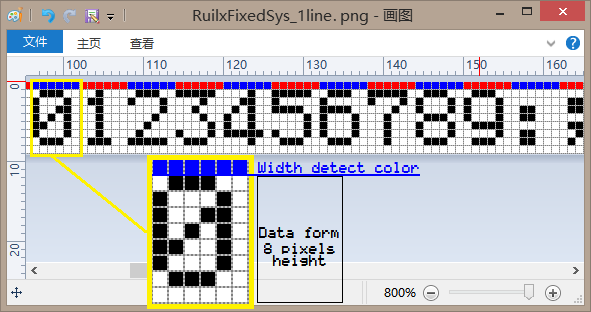
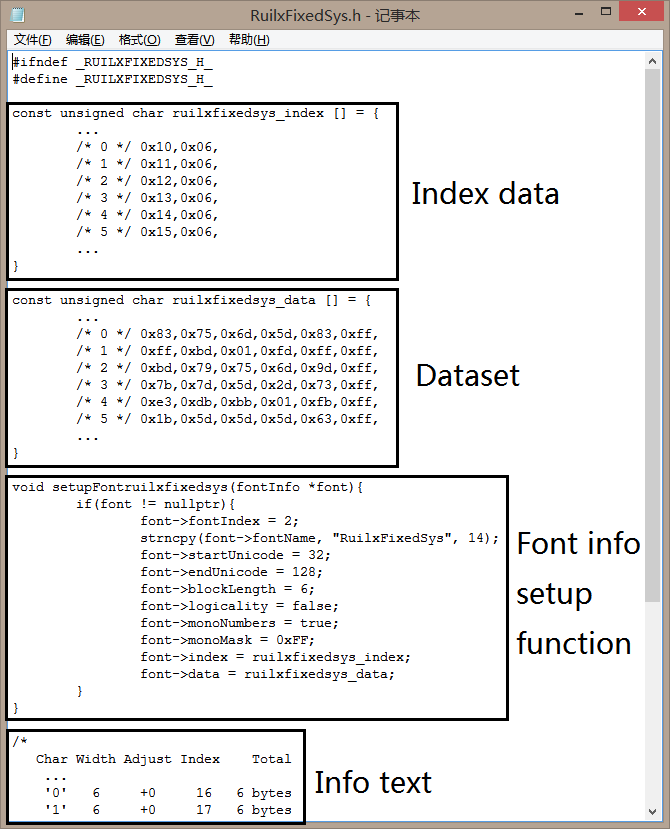

# ImageBinarization

The tool can convert pixel font image to binary data or C-style byte array and index data

This tool public under GNU General Public License Version 3, everyone can keep improving projects overall functions. 
But you might to read [GPL3](https://www.gnu.org/licenses/) before starting construction.

Therefore, you must keep LICENSE or other file name with same content 
in your root directory of every projects.

## Prepare

Draw a 9-pixel-height image with pixel-accessed painter program like "mspaint" (Microsoft Paint)
with first line show the character width and rest of 8 lines save the character data.

Pixels in white color are positive logic '0', pixel in black color are positive logic '1'.
And first line can use any different color (different hues are better) to specify the width of character.



Using image binarization tool to turn image data to hex array



## Requirements

The tool using python3 with requirement package in requirements.txt file.

Please use the shell below to install all runtime requirement packages.

```shell script
pip install -r requirement.txt
```

## Usage

Using '-h' or '--help' to show helping message description.

Recommend arguments:
```text
-i PATH  The file path to image.
-x INDEX The index of font, will write in setup function.
-b SIZE  The block size, we need to limit the first byte of index data less than 256, 
         so fitness size will balance the total bytes and index size.
-d DNAME Display name, it will write to display name part, and if font name left blank,
         font name will get lowercase of display name and remove spaces.
-o PATH  Output path, will output the result to stdout default.
``` 

Support arguments:
```text
-f BYTE  Adjust index block size in dataset with specified BYTE as placeholder. default: 0x00.
-s BYTE  Start character, printable ascii character starts at 0x20("<space>") normally.
-e BYTE  End character, printable ascii character ends at 0x7F("<del>") normally.
-c BOOL  Write C-style current char as comment in data.
-m STR   Binary bit order in image. MSB_AT_TOP(default), LSB_AT_TOP.
-l STR   Binary bit logic for pixel 'ON'. POSITIVE_LOGIC, NEGATIVE_LOGIC(default).
-t BYTE  Image pixel recognised to 'ON' threshold in grayscale. default 0x7F(127).
```

Special arguments:
```text
--special gpl3           Adding GPL3 license at top of file.
--special preprocessflag Adding C preprocess define around data.
```

## Issues

I am grateful you to setup an issue or make a pull request if you found any issues in projects (or tools),
and if you appreciate these projects (or tools), please light up a star on the right top of the page~

Many thanks for your star~